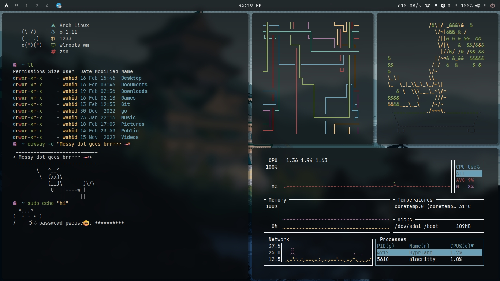
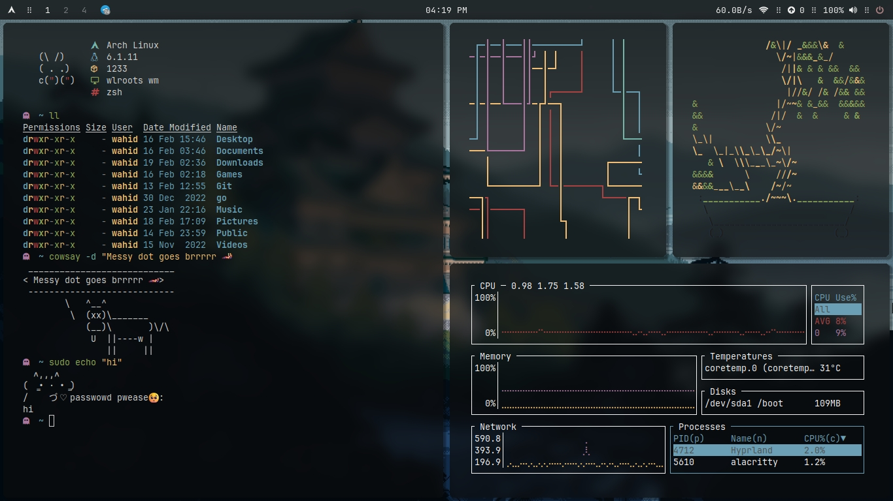
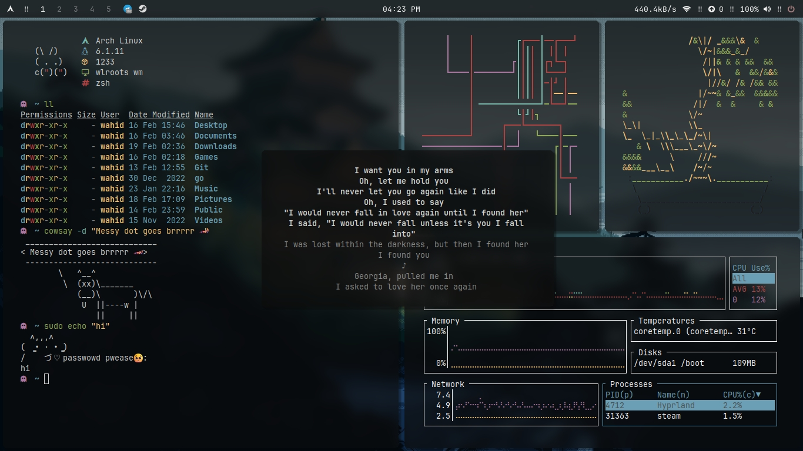
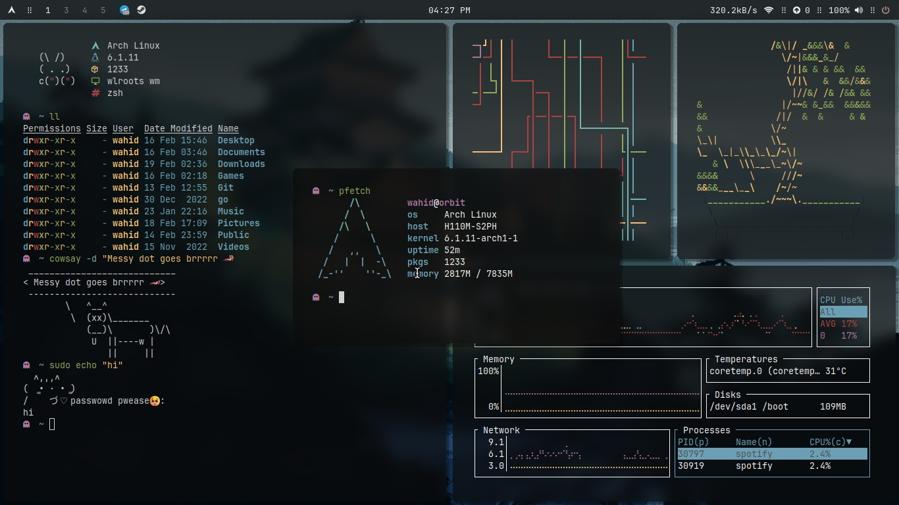
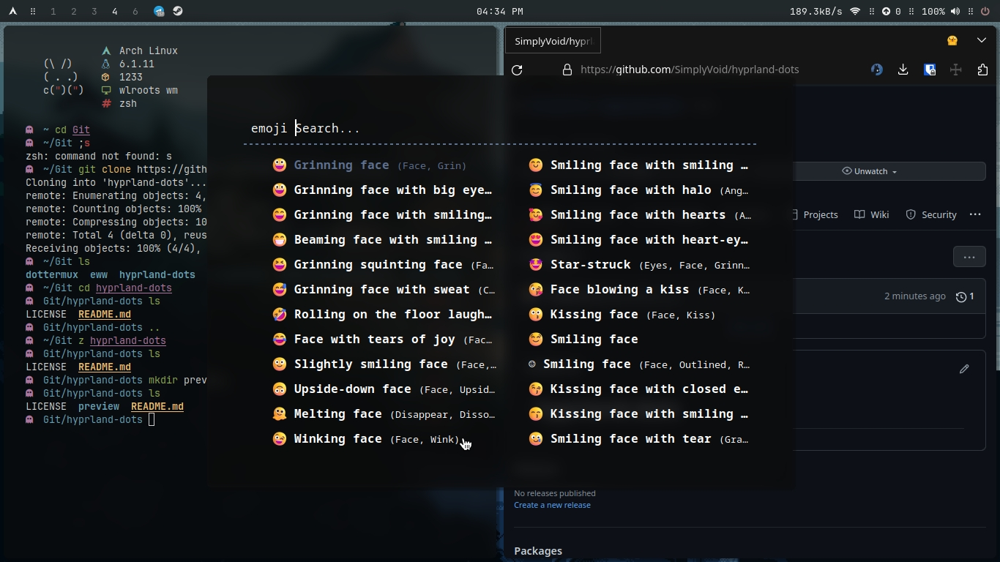
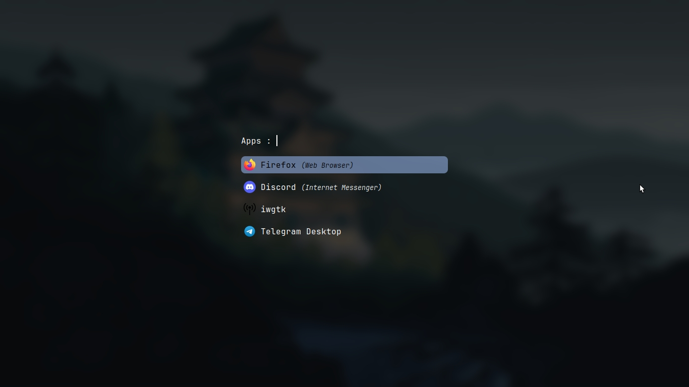
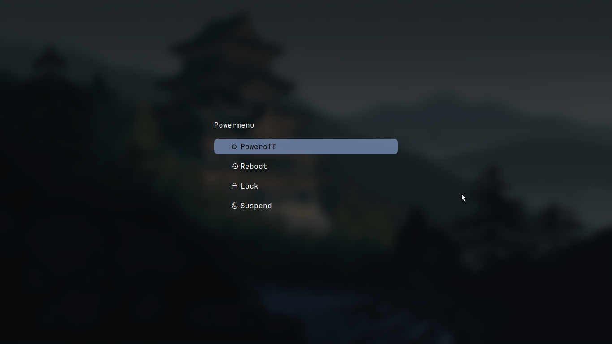

<h2 align="center"> ━━━━━━  ❖  ━━━━━━ </h2>
<!-- BADGES -->

   

   
   
   
   <!-- -->
	

  
   

-->

<h2></h2>

## ❖ Hyprland 

Hyprland dots from my arch machine :)
`readme wip`

### ❖ Details(wip)
- Suspendisse mollis ut urna nec auctor.
- Vestibulum a ante in leo efficitur accumsan.
- Donec molestie id dui non finibus. Donec elementu

### ❖ Screenshots:(wip)

